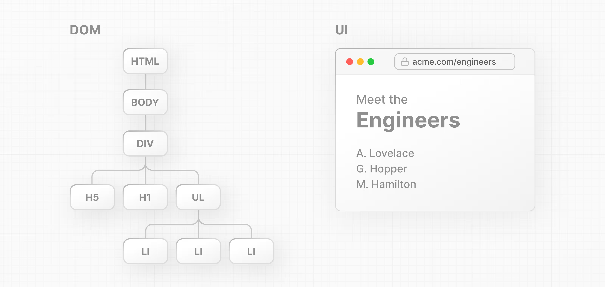
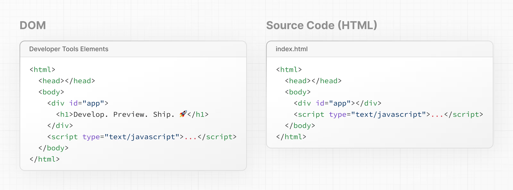

# About React and Next.js

Next.js is a flexible React framework that gives you building blocks to create fast, full-stack web applications.

But what exactly do we mean by this? Let's spend some time expanding on what React and Next.js are and how they can help you build web applications.

Building blocks of a web application
There are a few things you need to consider when building modern applications. Such as:

## User Interface - how users will consume and interact with your application.
## Routing - how users navigate between different parts of your application.
## Data Fetching - where your data lives and how to get it.
## Rendering - when and where you render static or dynamic content.
## Integrations - what third-party services you use (for CMS, auth, payments, etc.) and how you connect to them.
## Infrastructure - where you deploy, store, and run your application code (serverless, CDN, edge, etc.).
## Performance - how to optimize your application for end-users.
## Scalability - how your application adapts as your team, data, and traffic grow.
## Developer Experience - your team's experience building and maintaining your application.
For each part of your application, you will need to decide whether you will build a solution yourself or use other tools, such as packages, libraries, and frameworks.

## What is React?
React is a JavaScript library for building interactive user interfaces.

By user interfaces (UI), we mean the elements that users see and interact with on-screen.

User Interface example showing a browser window with a navigation, a sidebar, and a list of posts
By library, we mean React provides helpful functions (APIs) to build UI, but leaves it up to the developer where to use those functions in their application.

Part of React's success is that it is relatively unopinionated about the other aspects of building applications. This has resulted in a flourishing ecosystem of third-party tools and solutions, including Next.js.

It also means, however, that building a complete React application from the ground up requires some effort. Developers need to spend time configuring tools and reinventing solutions for common application requirements.

## What is Next.js?
Next.js is a React framework that gives you building blocks to create web applications.

By framework, we mean Next.js handles the tooling and configuration needed for React, and provides additional structure, features, and optimizations for your application.


The browser then reads the HTML and constructs the Document Object Model (DOM).

# What is the DOM?
The DOM is an object representation of the HTML elements. It acts as a bridge between your code and the user interface, and has a tree-like structure with parent and child relationships.

Two side-by-side diagrams, left showing the DOM tree, and right showing the rendered UI.


You can use DOM methods and JavaScript, to listen to user events and manipulate the DOM by selecting, adding, updating, and deleting specific elements in the user interface. DOM manipulation allows you to not only target specific elements, but also change their style and content.


Open your code editor and create a new index.html file. Inside the HTML file, add the following code:

```html

<html>
  <body>
    <div></div>
  </body>
</html>
Then give the div a unique id so that you can target it later.

index.html

<html>
  <body>
    <div id="app"></div>
  </body>
</html>
To write JavaScript inside your HTML file, add a script tag:

index.html

<html>
  <body>
    <div id="app"></div>
    <script type="text/javascript"></script>
  </body>
</html>
Now, inside the script tag, you can use a DOM method, getElementById(), to select the <div> element by its id:

index.html

<html>
  <body>
    <div id="app"></div>
    <script type="text/javascript">
      const app = document.getElementById('app');
    </script>
  </body>
</html>
You can continue using DOM methods to create a new <h1> element:

index.html

<html>
  <body>
    <div id="app"></div>
    <script type="text/javascript">
      // Select the div element with 'app' id
      const app = document.getElementById('app');
 
      // Create a new H1 element
      const header = document.createElement('h1');
 
      // Create a new text node for the H1 element
      const text = 'Develop. Preview. Ship.';
      const headerContent = document.createTextNode(text);
 
      // Append the text to the H1 element
      header.appendChild(headerContent);
 
      // Place the H1 element inside the div
      app.appendChild(header);
    </script>
  </body>
</html>

To make sure everything is working, open your HTML file inside your browser of choice. You should see an h1 tag that says, 'Develop. Preview. Ship.'.

HTML vs. the DOM
If you look at the DOM elements inside your browser developer tools, you will notice the DOM includes the <h1> element. The DOM of the page is different from the source code - or in other words, the original HTML file you created.

Two side-by-side diagrams showing the differences between the rendered DOM elements and Source Code (HTML)

This is because the HTML represents the initial page content, whereas the DOM represents the updated page content which was changed by the JavaScript code you wrote.

Updating the DOM with plain JavaScript is very powerful but verbose. You've written all this code to add an <h1> element with some text:

    <script type="text/javascript">
  const app = document.getElementById('app');
  const header = document.createElement('h1');
  const text = 'Develop. Preview. Ship.';
  const headerContent = document.createTextNode(text);
  header.appendChild(headerContent);
  app.appendChild(header);
</script>
As the size of an app or team grows, it can become increasingly challenging to build applications this way.

With this approach, developers spend a lot of time writing instructions to tell the computer how it should do things. But wouldn't it be nice to describe what you want to show and let the computer figure out how to update the DOM?

# Imperative vs. declarative programming
The code above is a good example of imperative programming. You're writing the steps for how the user interface should be updated. But when it comes to building user interfaces, a declarative approach is often preferred because it can speed up the development process. Instead of having to write DOM methods, it would be helpful if developers were able to declare what they want to show (in this case, an h1 tag with some text).

In other words, imperative programming is like giving a chef step-by-step instructions on how to make a pizza. Declarative programming is like ordering a pizza without being concerned about the steps it takes to make the pizza. 🍕

React is a popular declarative library that you can use build user interfaces.

```html
 <html>
  <body>
    <div id="app"></div>
    <script src="https://unpkg.com/react@18/umd/react.development.js"></script>
    <script src="https://unpkg.com/react-dom@18/umd/react-dom.development.js"></script>
    <script type="text/javascript">
      const app = document.getElementById('app');
      const header = document.createElement('h1');
      const text = 'Develop. Preview. Ship.';
      const headerContent = document.createTextNode(text);
      header.appendChild(headerContent);
      app.appendChild(header);
    </script>
  </body>
</html>

 <html>
  <body>
    <div id="app"></div>
    <script src="https://unpkg.com/react@18/umd/react.development.js"></script>
    <script src="https://unpkg.com/react-dom@18/umd/react-dom.development.js"></script>
    <script>
      const app = document.getElementById('app');
      const root = ReactDOM.createRoot(app);
      root.render(<h1>Develop. Preview. Ship by react dom.</h1>);
    </script>
  </body>
</html> 

<html>
  <body>
    <div id="app"></div>
    <script src="https://unpkg.com/react@18/umd/react.development.js"></script>
    <script src="https://unpkg.com/react-dom@18/umd/react-dom.development.js"></script>
    <!-- Babel Script -->
    <script src="https://unpkg.com/@babel/standalone/babel.min.js"></script>
    <script type="text/jsx">
      const domNode = document.getElementById('app');
      const root = ReactDOM.createRoot(domNode);
      root.render(<h1>Develop. Preview. Ship using react and babel.</h1>);
    </script>
  </body>
</html>

React core concepts
There are three core concepts of React that you'll need to be familiar with to start building React applications. These are:

Components
Props
State

